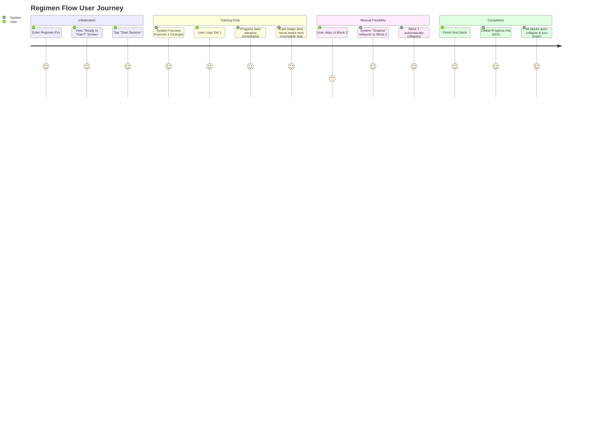
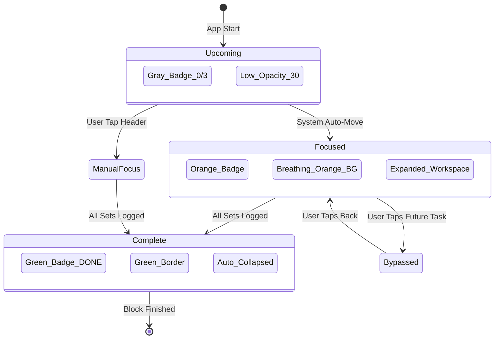

# Regimen Flow Logic & UX

## Overview
**Regimen Flow** is a high-performance training logger designed for "Focus-First" gym use. It utilizes an intelligent state machine to guide the user through their workout with zero distraction.

## User Journey Map

## Core Functional Phases

### 1. Landing Screen (The Gatekeeper)
When the user selects **Regimen Pro** from the Hub, they are presented with a focused "Ready to Train?" screen.
- **Action:** Clicking "Start Session" initializes the global state, sets the start timestamp, and moves the "System Cursor" to the first exercise.

### 2. The "Following Shadow" Engine
The app acts as an intelligent assistant that recommends the next step while respecting user freedom.
- **Intelligent Seeking:** When a set is finished, the app doesn't just move to the next index; it scans for the **next incomplete task** in the whole session.
- **Accordion Handoff:** Only **one block** is expanded at a time. Tapping a new block automatically collapses the previous one.
- **Breathing Signal:** If the user moves away from the recommended task, that task starts **Breathing Orange** to call for attention.

### 3. Visual Language (The State Machine)

## Dashboard Features

### 1. Fixed Global Progress Bar
- **Location:** Fixed at the very top of the app.
- **Behavior:** Real-time calculation of `Logged Sets / Total Sets` for the entire session.
- **Style:** 3px Orange bar with outer glow for premium visibility.

### 2. Block-Level Progress
- **Set-Granular:** The thin progress bar at the bottom of each block header moves instantly upon logging a single set.
- **Percentage Readout:** A digital readout (e.g., `45%`) in the header glows in accent color.

### 3. Progressive Badge Logic
- **Count-Up:** Exercise badges start at `0/X` (Completed / Total).
- **Engagement:** The badge turns **Green** as soon as the first set is logged (`1/X`), visually ticking off the checklist.

### 4. Native Experience
- **Touch Protection:** `user-select: none` is applied globally to prevent accidental text selection during heavy usage.
- **Accordion UI:** Automatic focus management ensures the current task is always framed correctly on the screen.

## Technical Implementation
- **State Management:** Zustand (`useTrainingStore`) with storage key `v18`.
- **Persistence:** Local-First via IndexedDB (Survives refreshes/unmounts).
- **Animation:** Low-CPU CSS Keyframes for "Breathing" and "Progress" effects.
- **Relational Data:** Transitioned to set-based progress tracking for 100% precision.
