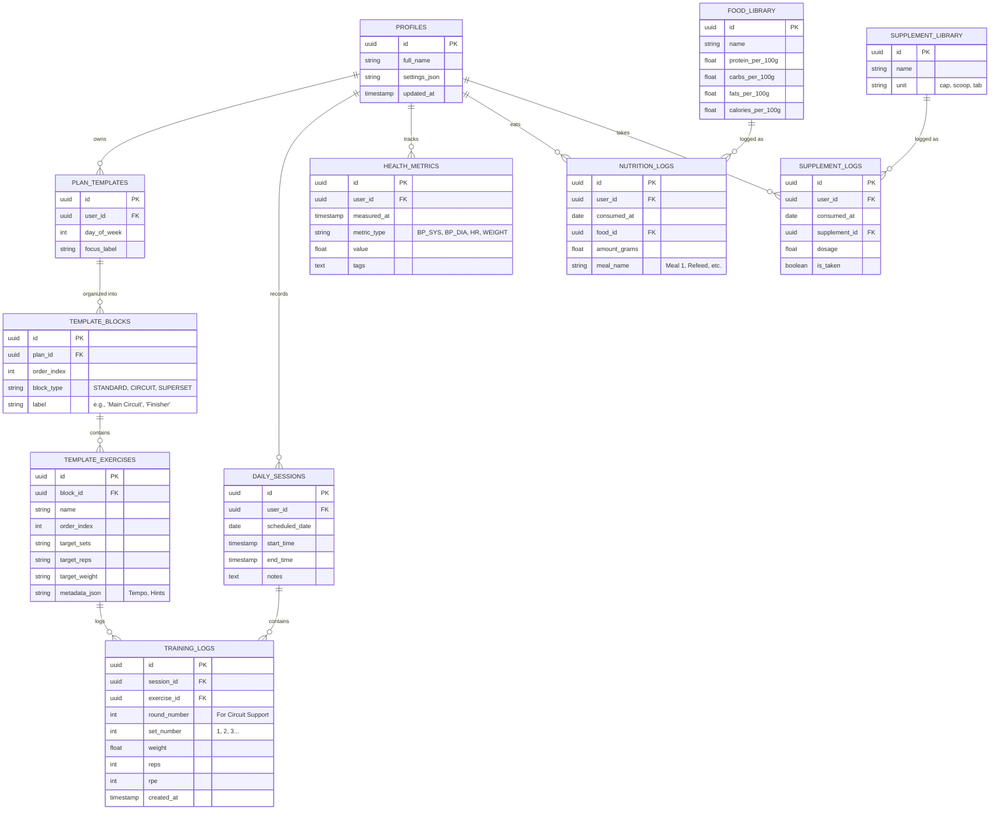

# Database Schema Design (v2.0 - Block Architecture)

## Overview
The V2 schema utilizes a **Block-Based Relational Model**. This allows for complex workout structures (multiple circuits, supersets, and standard sets) while maintaining the **Relational Delta Model** to minimize Supabase egress.

## Mermaid ER Diagram

## Core Design Logic

### 1. Training "Blocks"
This is the most critical feature for the **Routine Editor** and **Circuit Training**.
- Exercises are no longer flat lists. They belong to **Blocks**.
- A single Day can have multiple Blocks (e.g., Standard Warmup -> Circuit 1 -> Standard Heavy Lift -> Circuit 2).
- **UI Progress:** The logger uses the `order_index` of `TEMPLATE_BLOCKS` to show "Circuit 1 of 3" headers.

### 2. High-Efficiency Circuits
- When `block_type = CIRCUIT`, the React UI renders the vertical "Round-Based" logging flow.
- The `TRAINING_LOGS` table explicitly stores the `round_number`, ensuring your history knows exactly how you cycled through the circuit.

### 3. Nutrition & Supplements
- **Relational Libraries:** Moving away from text blobs to a `FOOD_LIBRARY` ensures macro-calculation accuracy.
- **Compliance Tracking:** `SUPPLEMENT_LOGS` allows for per-item "Taken" tracking rather than just a daily "Done" flag.

## Impact on Egress
| Operation | Legacy (Blob) | New (Relational) |
| :--- | :--- | :--- |
| **Log 1 Set** | 50 KB (Whole Day) | **0.2 KB** (1 Row) |
| **Switch Days** | 50 KB (Whole Day) | **0.5 KB** (Session Meta) |
| **Check Supplement** | 50 KB (Whole Day) | **0.1 KB** (Boolean Flag) |
