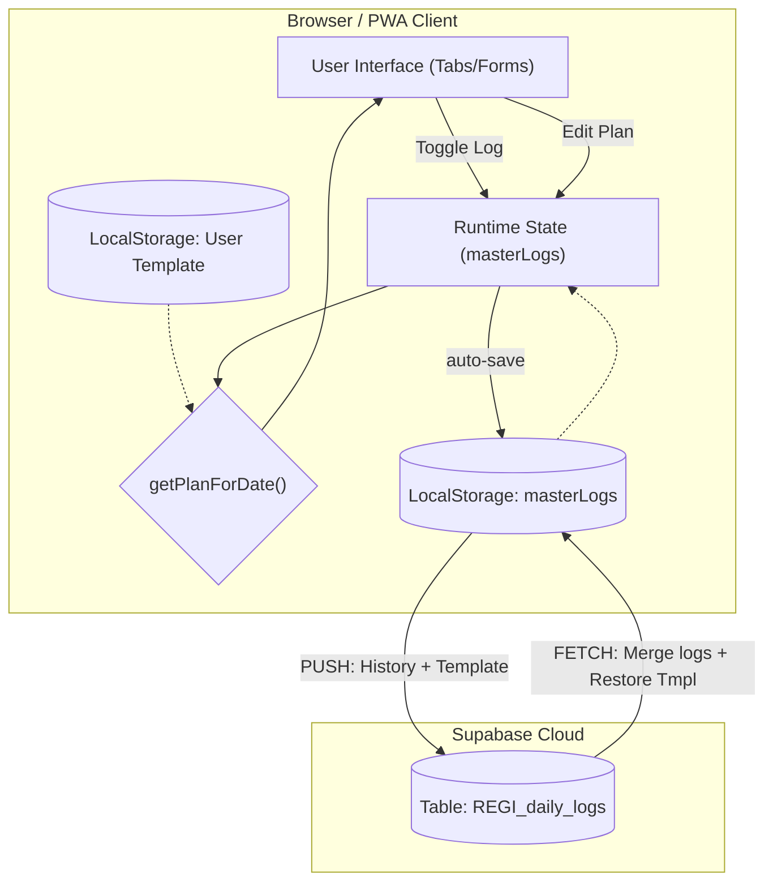
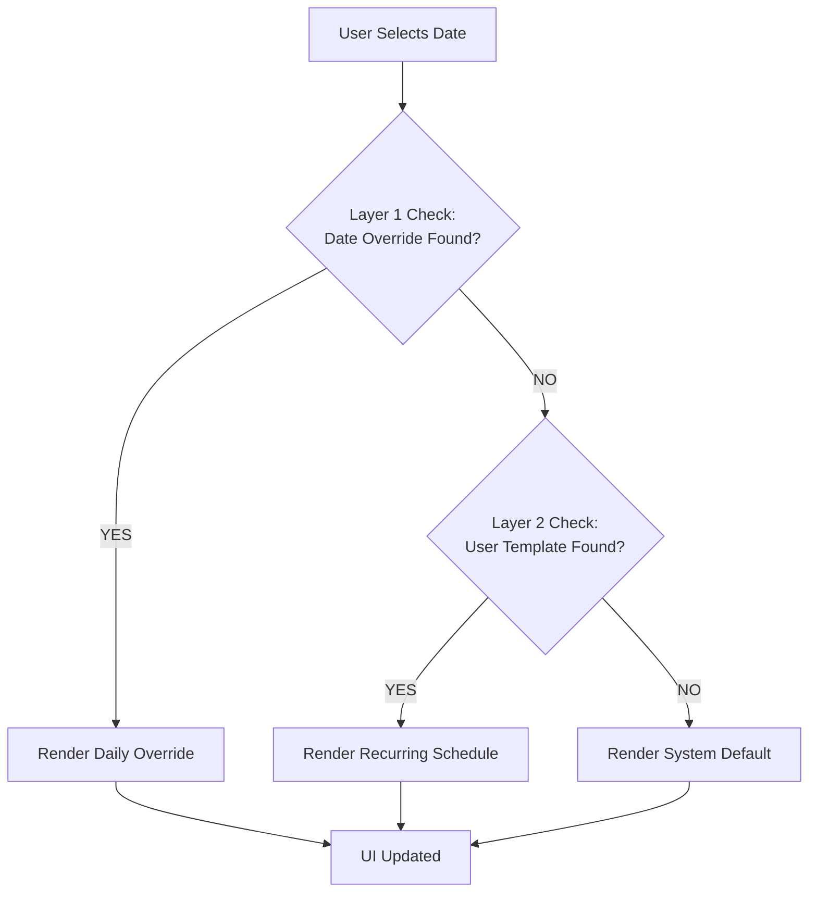
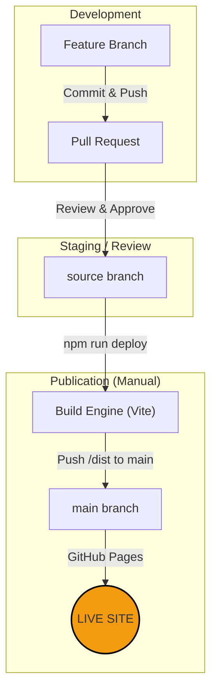

# System Architecture: Regimen Pro PWA

The Regimen Pro PWA is an "Offline-First" application designed for performance tracking and dynamic schedule management. It uses a tiered data resolution strategy and a unique "System Image" synchronization approach.

## 1. High-Level Data Flow

The application manages two types of data: **Performance History** (logs, checkmarks) and **Schedule Configuration** (what you plan to do).

---

## 2. The "Three-Layer" Logic (Plan Resolution)

When a user selects a date, the system must decide which plan (Training/Nutrition/Supps) to display. It follows this priority order:

1.  **Layer 1: Daily Exception (Highest Priority)**
    *   **Stored in:** `masterLogs[dateKey].plan_overrides`
    *   **Purpose:** One-off changes for a specific date (e.g., "Eating out today").
2.  **Layer 2: User Template (Medium Priority)**
    *   **Stored in:** `localStorage['regimen_user_template']`
    *   **Purpose:** The user's custom recurring weekly schedule (e.g., "My new Tuesday fish diet").
3.  **Layer 3: System Default (Lowest Priority)**
    *   **Stored in:** `const DEFAULT_PLAN` (Hardcoded)
    *   **Purpose:** Factory settings and fallback for unconfigured days.

### Resolution Flowchart

---

## 3. Synchronization Strategy ("System Image" Bundling)

To simplify the backend while ensuring a "Self-Healing" restore process, the app uses a bundling strategy.

*   **Push (Sync):** Every daily log sent to the Supabase `data` column includes a snapshot of the current `regimen_user_template`.
*   **Pull (Fetch):** When fetching, the app iterates through all logs and identifies the most recent one. It extracts the `user_template_snapshot` from that log and restores it to the local environment.

**Benefit:** If you log in on a brand-new device, clicking **FETCH** reconstructs not just your history, but your entire customized weekly schedule automatically.

---

## 4. Key Technical Data
*   **Database Table:** `public.REGI_daily_logs`
*   **Unique Index:** `user_id`, `date`
*   **Primary State Variable:** `masterLogs` (Indexed by ISO date string `YYYY-MM-DD`).
*   **Template Key:** `regimen_user_template` (Indexed by Day of Week `0-6`).

---

## 5. Publication Lifecycle

The project uses a professional separation between source code and production assets.

### Steps to Publish:
1.  **Merge PR:** Combine feature code into the `source` branch on GitHub.
2.  **Sync Local:** `git checkout source && git pull`.
3.  **Run Deploy:** Execute `npm run deploy`. This triggers the `predeploy` (build) and pushes the optimized bundle to the `main` branch.
