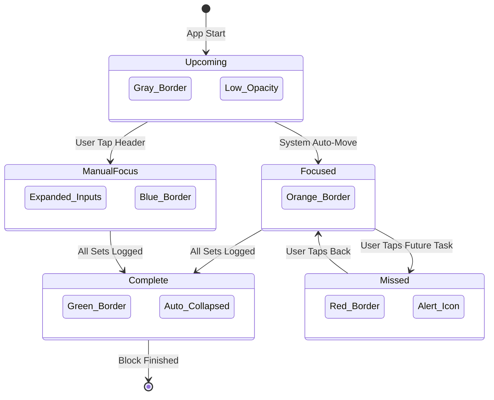

# Regimen Flow Logic & UX

## Overview
**Regimen Flow** is a high-performance training logger designed for "Focus-First" gym use. It utilizes an intelligent state machine to guide the user through their workout with zero distraction.

## Visual Language (The State Machine)

## Core UX Rules

### 1. The "Design 2" Header Pattern
Optimized for mobile density and targets:
- **Line 1:** [Status Badge] + [Exercise Name] + [Chevron]
- **Line 2:** [Recommended Targets (KG, REPS, RPE, TEMPO)] - Aligned Right.
- **Rule:** Targets are hidden when the exercise is collapsed to maximize space.

### 2. Guided Focus (The Cursor)
- **Automatic:** The app automatically opens the first incomplete exercise. When a set is finished, it "snaps" to the next step.
- **Manual Override:** Tapping any header instantly shifts the Orange Focus to that exercise.
- **Auto-Collapse:** To prevent clutter, only **one** exercise is expanded at a time. Tapping a new one closes the old one.

### 3. Block Management
- **Linear Handoff:** When all exercises in a "Strength Phase" are Green, the entire block auto-minimizes and the first exercise of the "Circuit Phase" expands.
- **Success Feedback:** Completed block headers turn Green and display a Checkmark.

## Technical Implementation
- **State Management:** Zustand (`useTrainingStore`).
- **Data Model:** Block-Based Relational Schema.
- **Persistence:** Local-First (IndexedDB via Persist Middleware).
