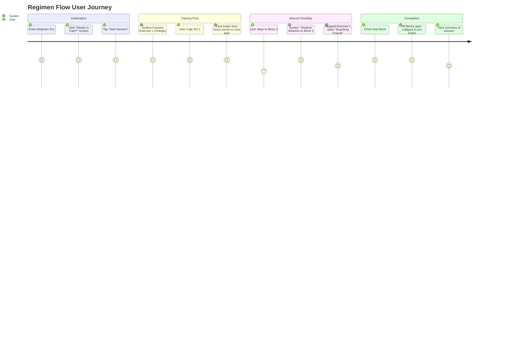
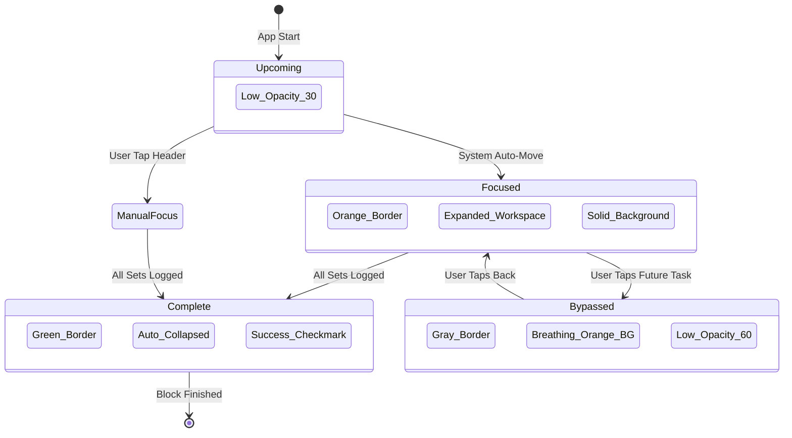

# Regimen Flow Logic & UX

## Overview
**Regimen Flow** is a high-performance training logger designed for "Focus-First" gym use. It utilizes an intelligent state machine to guide the user through their workout with zero distraction.

## User Journey Map

## Core Functional Phases

### 1. Landing Screen (The Gatekeeper)
When the user selects **Regimen Pro** from the Hub, they are presented with a focused "Ready to Train?" screen.
- **Visuals:** Minimalist view with an activity icon and a large **"Start Session"** button.
- **Action:** Clicking "Start Session" initializes the global state, sets the start timestamp, and moves the "System Cursor" to the first exercise of the first block.

### 2. The "Following Shadow" Engine
The app acts as an intelligent assistant that recommends the next step while respecting user freedom.
- **Guided recommendation:** Only one exercise is expanded at a time.
- **Manual Override:** If a user taps an exercise in a different block, the System Focus "teleports" to that new block to follow the user's lead.
- **Breathing Signal:** If the user moves away from the recommended task, that task starts **Breathing Orange** (a soft pulsing background animation) to call for attention without being intrusive.

### 3. Visual Language (The State Machine)

## Core UX Rules

### 1. The "Design 2" Header Pattern
Optimized for mobile density and large hit targets:
- **Line 1:** [Status Badge] + [Exercise Name] + [Collapse Chevron]
- **Line 2:** [Recommended Targets (KG, REPS, RPE, TEMPO)] - Aligned Right.
- **Rule:** Targets and History are hidden when the exercise is collapsed to maximize vertical space.

### 2. Guided Focus (The Cursor)
- **Automatic progression:** Finalling a set "snaps" the current card shut and opens the next one.
- **Partial Progress Reward:** Logged exercises show a **Green Badge** immediately to act as a visual checklist.
- **Strict Single-Focus:** Opening a new workspace automatically collapses all others.

### 3. Block Management
- **Auto-Minimize:** When every exercise in a block is finished (logged), the entire block snaps shut.
- **Success Feedback:** Completed block headers transition from Orange to **Success Green** with a Checkmark icon.

## Technical Implementation
- **State Management:** Zustand (`useTrainingStore`) with partitioned System/User focus logic.
- **Persistence:** Local-First (Zustand `persist` middleware). Survives refreshes and unmounts.
- **Animation:** CSS Keyframes for "Breathing" effects to minimize CPU overhead on mobile.