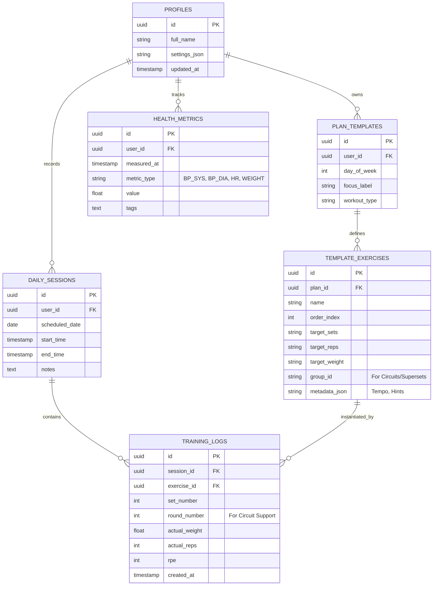

# Database Schema Design (v2.0 - Normalized)

## Overview
The V2 schema shifts from **Monolithic JSON Blobs** to a **Relational Delta Model**. This design minimizes Supabase egress by only transmitting changed rows (Deltas) rather than entire day structures.

## Mermaid ER Diagram

## Table Descriptions

### 1. `PLAN_TEMPLATES` & `TEMPLATE_EXERCISES`
Replaces the `DEFAULT_PLAN` constant. These tables store your recurring weekly schedule.
- **Egress Savings:** Only fetched once per week/session and cached locally.
- **Circuit Support:** `group_id` allows the UI to group multiple exercises into a single "Round Flow."

### 2. `DAILY_SESSIONS`
A light wrapper for a specific day's workout.
- Stores metadata like "Start/End" times and general workout notes.

### 3. `TRAINING_LOGS`
The primary "Delta" table. Every time you finish a set, **one row** is sent to Supabase.
- **Egress Savings:** Sending 1 row (~200 bytes) vs 1 Blob (~50KB) reduces traffic by **99.6%**.
- **Round Number:** Crucial for the Circuit redesign. Allows the UI to render: 
  *Round 1 -> Ex A, Ex B*
  *Round 2 -> Ex A, Ex B*

### 4. `HEALTH_METRICS`
A dedicated table for the new **Blood Pressure Tracker**.
- `metric_type` allows for extensible health tracking (Blood Pressure, Weight, Blood Glucose, etc.) without adding new tables.

## Impact on Egress
| Operation | Legacy (Blob) | New (Relational) | Improvement |
| :--- | :--- | :--- | :--- |
| Load Today | 50 KB | 2 KB (Metadata only) | 25x Better |
| Log 1 Set | 50 KB | 0.2 KB | 250x Better |
| View History | 1.5 MB (Month) | 15 KB (Logs only) | 100x Better |
