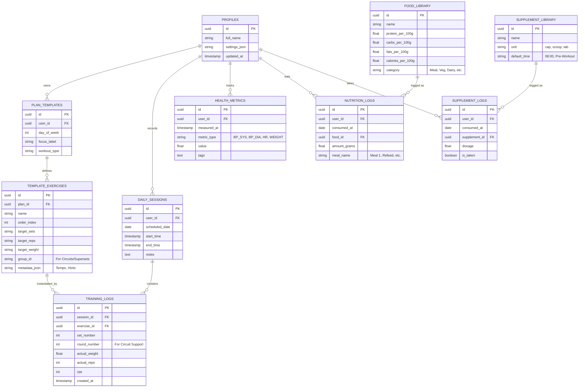

# Database Schema Design (v2.0 - Normalized)

## Overview
The V2 schema shifts from **Monolithic JSON Blobs** to a **Relational Delta Model**. This design minimizes Supabase egress by only transmitting changed rows (Deltas) rather than entire day structures.

## Mermaid ER Diagram

## Table Descriptions

### 1. Training Architecture (`DAILY_SESSIONS`, `TRAINING_LOGS`)
- **Circuit Support:** `group_id` in templates and `round_number` in logs allow the UI to render "Round 1 -> All Exercises" flows.
- **Delta Logging:** Only the finished set is sent to the server.

### 2. Nutrition Suite (`FOOD_LIBRARY`, `NUTRITION_LOGS`)
Instead of a text list of foods, we now have a relational library.
- **Precision:** Tracking grams of specific foods allows the app to calculate total daily protein/calories automatically.
- **Meal Grouping:** `meal_name` allows the app to group logs into the "Meal 1", "Meal 2" structure you prefer.

### 3. Supplement Suite (`SUPPLEMENT_LIBRARY`, `SUPPLEMENT_LOGS`)
- **Stacks:** You can define a "Lunch Stack" in the library and log individual items or the whole group.
- **History:** Enables checking exactly when you took specific items (e.g., "Did I take my Vitamin D today?").

### 4. Health Metrics (`HEALTH_METRICS`)
- Used for the **Blood Pressure Tracker**.
- Optimized for time-series charts.

## Impact on Egress
| Operation | Legacy (Blob) | New (Relational) | Improvement |
| :--- | :--- | :--- | :--- |
| Load Today | 50 KB | 2 KB (Metadata only) | 25x Better |
| Log 1 Set/Meal | 50 KB | 0.2 KB | 250x Better |
| View History | 1.5 MB (Month) | 15 KB (Logs only) | 100x Better |