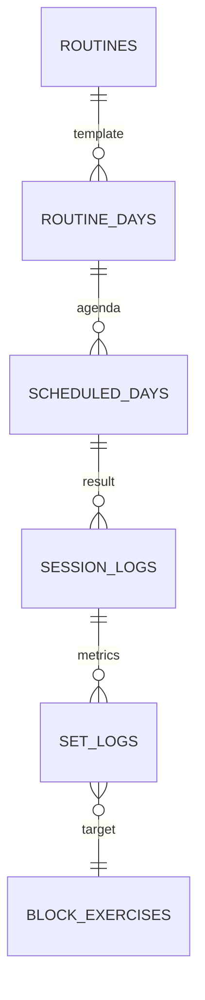

# V2 Relational Data Engine (Calendar-Ready)

## Overview
The V2 Data Engine is a relational migration designed for minimal data egress, high performance on mobile, and absolute scheduling flexibility. It prepares the application for a future **Calendar/Agenda** view while maintaining the intelligent "Flow" engine.

## The "Three-Layer" Architecture

To handle real-world training (skipping days, swapping workouts, ad-hoc sessions), the data is partitioned into three layers:

### 1. Layer 1: The Template (The "What")
- **Tables:** `v2.routines`, `v2.routine_days`.
- **Purpose:** Defines the master plan (e.g., "Day 1 is always Push").
- **Structure:** A fixed loop of **N Days**.

### 2. Layer 2: The Agenda (The "When")
- **Table:** `v2.scheduled_days`.
- **Purpose:** Bridges the Template to the Actual Calendar.
- **Flexibility:** This is where you **Shift**, **Swap**, or **Skip** days. 
- **Example:** Moving "Legs" from Tuesday to Wednesday only requires updating a single date in this table.

### 3. Layer 3: The Record (The "Proof")
- **Tables:** `v2.session_logs`, `v2.set_logs`.
- **Purpose:** Stores the actual performance data.
- **Ad-hoc Support:** A session can be "Unlinked" from the Agenda (NULL `scheduled_day_id`), supporting purely spontaneous workouts.

## Visual Relationship

## SQL Deployment
The schema is isolated in the `v2` namespace.
*Script location: `src/data/v2_schema_init.sql`*

## Key UX Scenarios

| Scenario | Logic Path |
| :--- | :--- |
| **Shift Forward** | Update `date` column in `v2.scheduled_days`. |
| **Skip Day** | Set `status` to 'SKIPPED' in `v2.scheduled_days`. |
| **Swap Workouts** | Switch the `routine_day_id` links between two dates in the Agenda. |
| **Ad-hoc Workout** | Create a `v2.session_log` with `scheduled_day_id = NULL`. |
| **Next Day Rec** | Query `scheduled_days` where `date = today`. If empty, find last `COMPLETED` and suggest `last_index + 1`. |