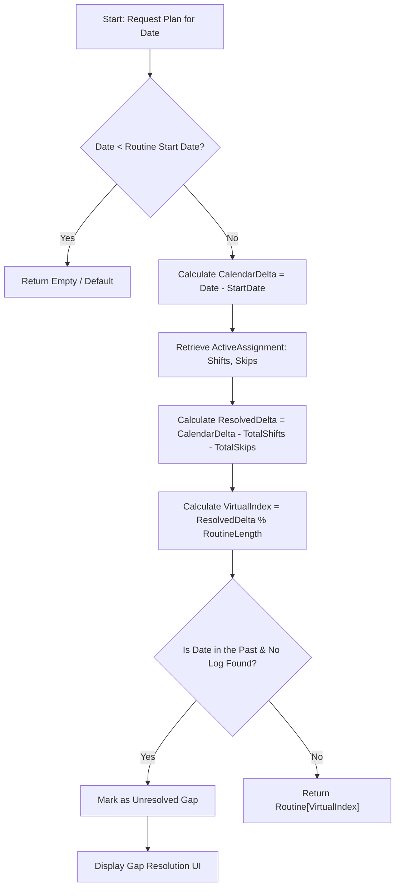
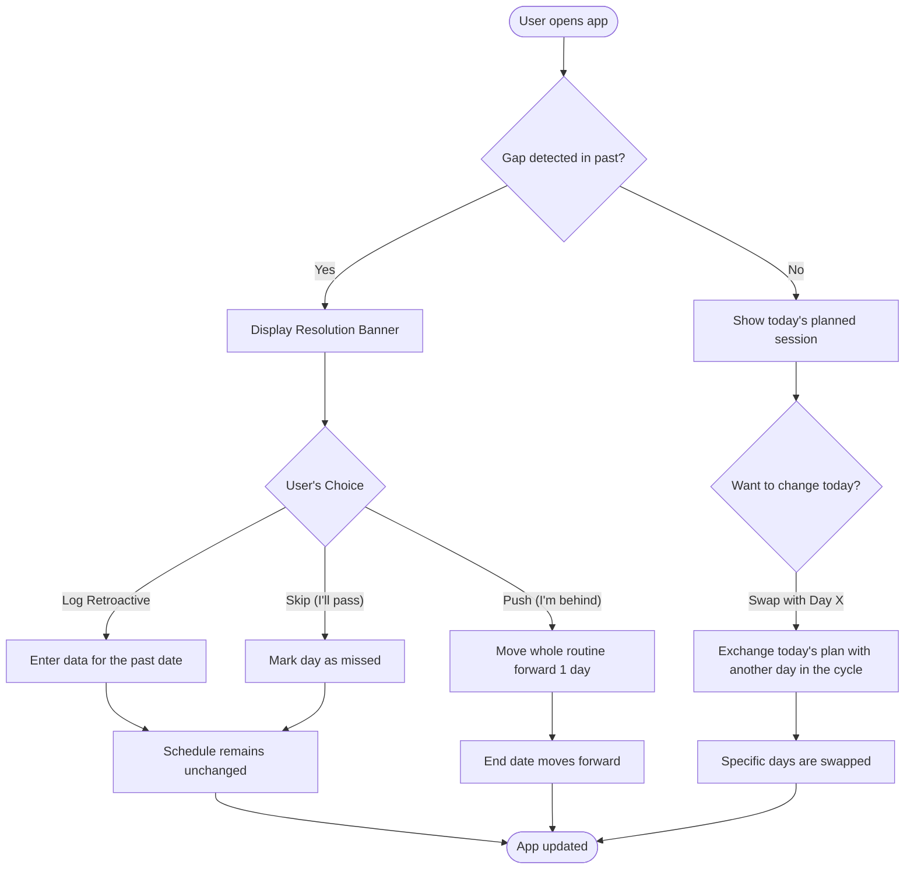

# TASK-18: Task: Routine Planner Logic & Flowchart Design

**Related Epic:** #17

## Status
- **Status:** UAT
- **Tier:** 3
- **Progress:** 100%

## Implementation Details
- Created [docs/PLANNER_LOGIC.md](https://github.com/borissimov/borissimov.github.io/blob/task-18-routine-planner-design/docs/PLANNER_LOGIC.md) with architectural and user flowcharts.
- Defined Virtual Day Index formula: `ResolvedDelta % RoutineLength`.
- Defined JSON schemas for `Routine` and `ActiveAssignment`.
- Mapped out Gap Resolution state machine (Log/Push/Skip/Swap).

## 1. Technical Flow (Resolution Logic)

## 2. User Choice Flow (UX)

## Tasks
- [x] Design technical logic flowchart.
- [x] Design user choice/UX flowchart.
- [x] Define data schema for routines and assignments.
- [x] Define resolution state machine.
- [ ] Visual Sign-off from user.